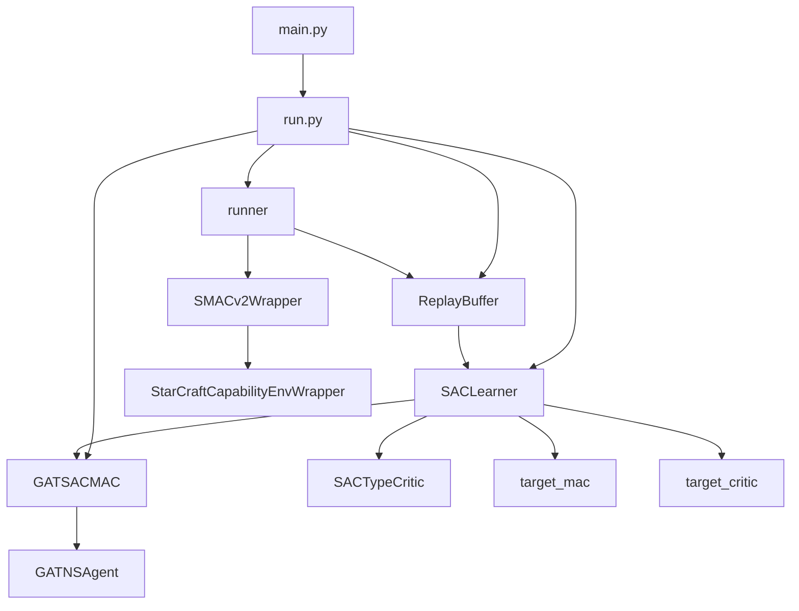
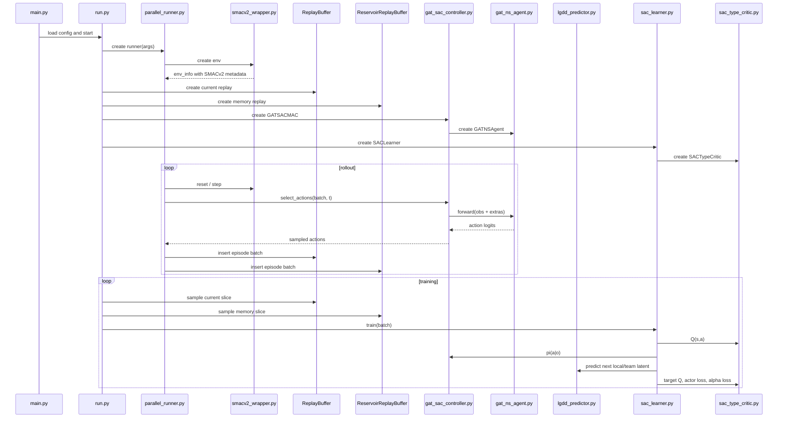
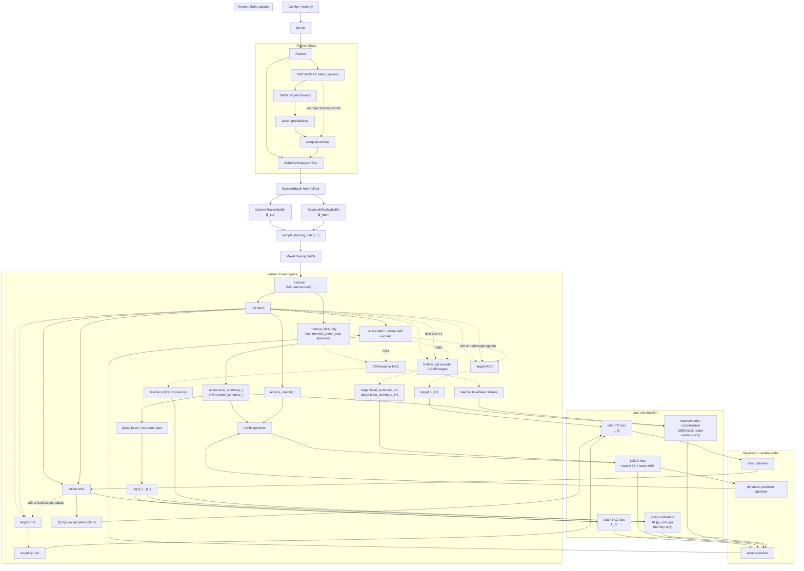
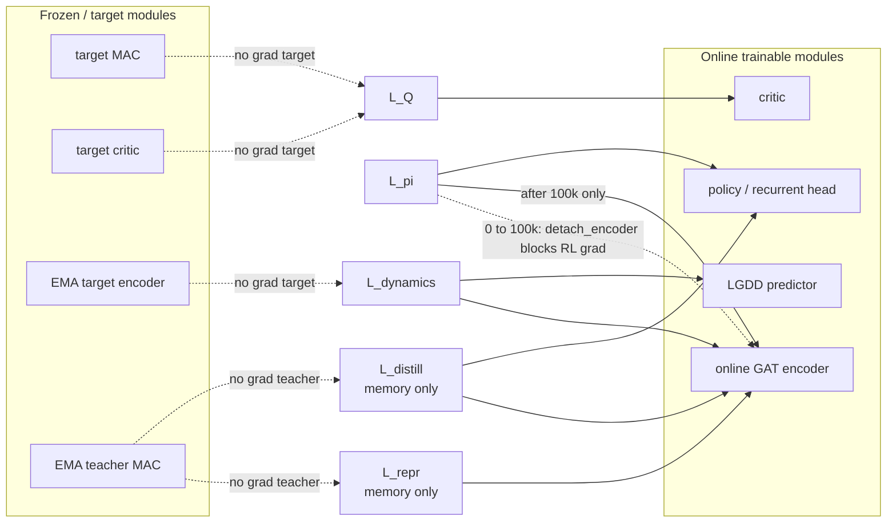
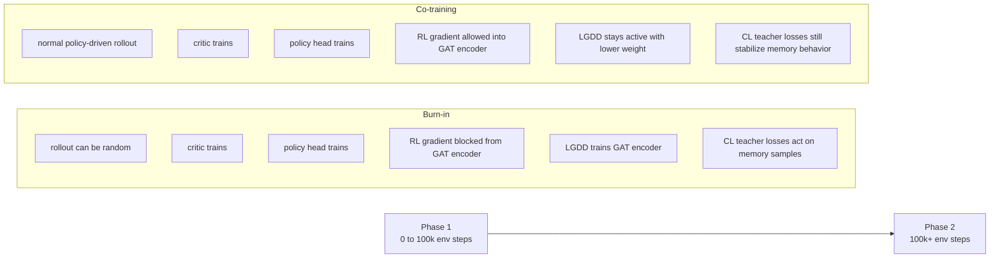
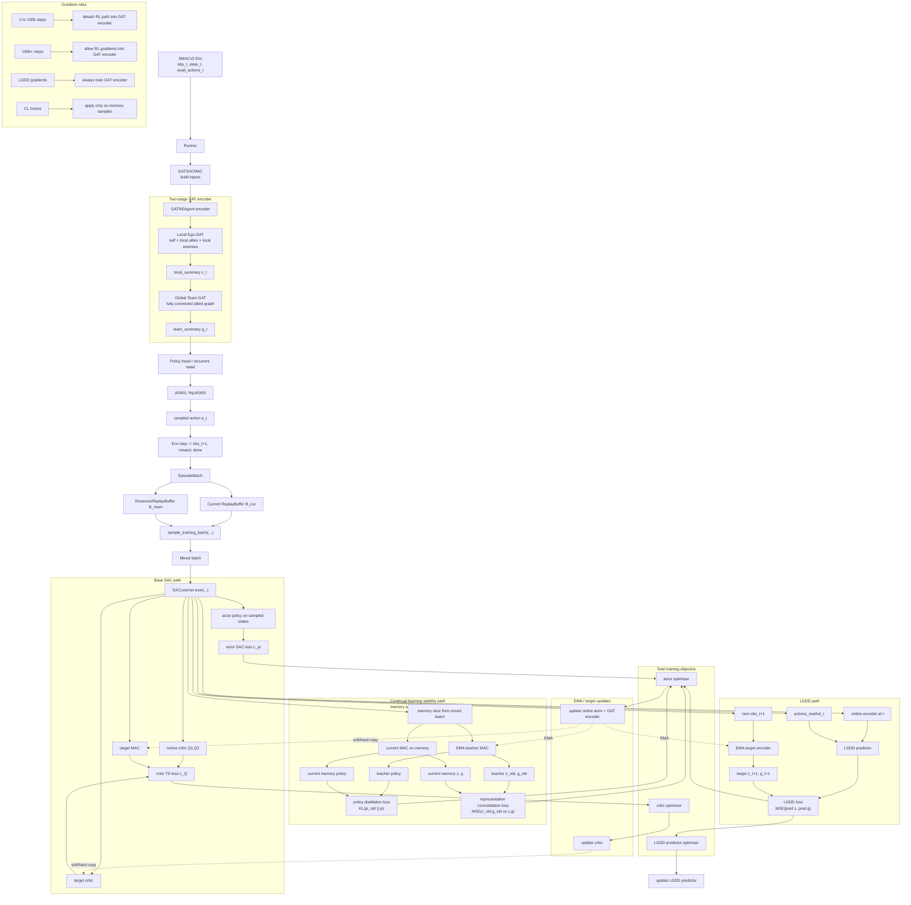
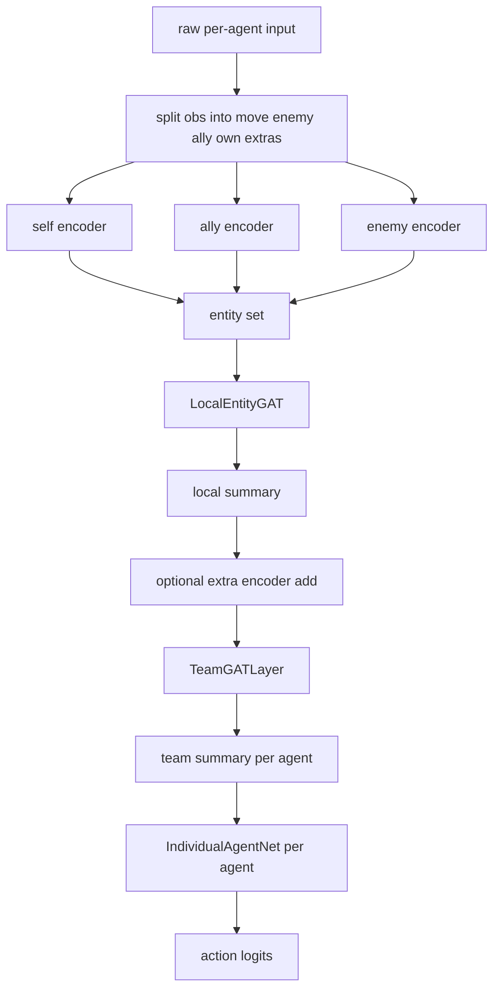
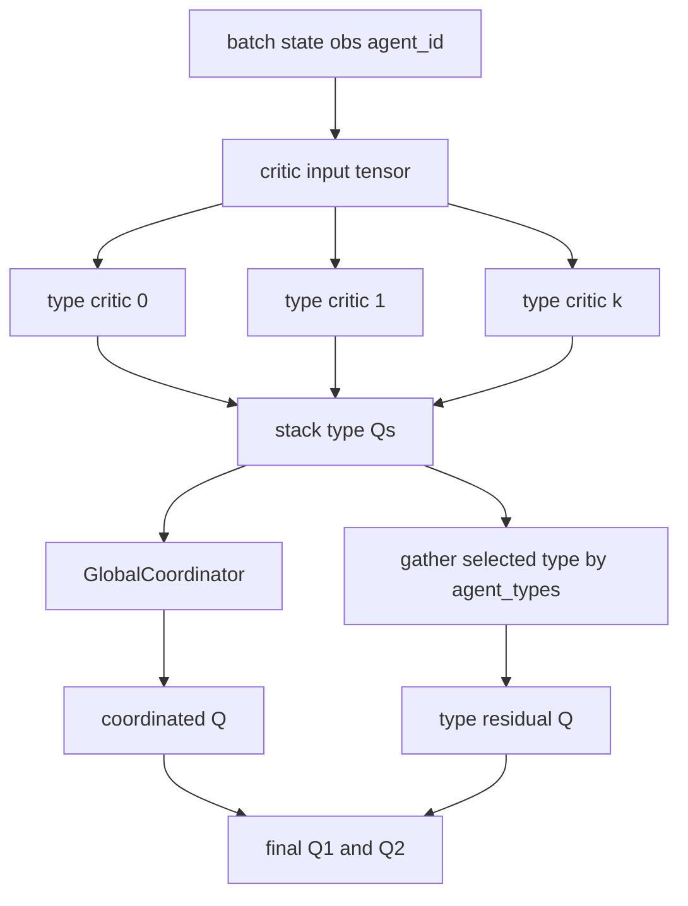

# GAT-SAC Architecture in `pymarl2`

## 1. Scope

This document explains the implemented `gat_sac` algorithm in this repository as it exists in the current `pymarl2` codebase. It is not a generic SAC note and it is not a copy of the older `epymarl` design. It describes the actual code path, the actual file wiring, the data contracts between modules, and the exact way SMACv2 support is used for this algorithm.

The focus is:

- how `gat_sac` is registered and launched
- how SMACv2 metadata is propagated into the model
- how rollout data is stored in replay
- how the actor is built around two-stage graph attention
- how the type-aware twin critic works
- how the SAC learner updates actor, critic, target networks, and entropy temperature
- how to operate and modify the system

## 2. Quick Summary

At a high level, the implemented stack is:

1. `src/main.py` loads config and starts the selected runner.
2. `src/run/run.py` builds the replay scheme, controller, learner, and training loop.
3. `src/envs/smacv2_wrapper.py` wraps the real SMACv2 environment and exposes extra observation/type metadata.
4. `src/runners/parallel_runner.py` or `src/runners/episode_runner.py` collects episodes and writes them into `EpisodeBatch`.
5. `src/controllers/gat_sac_controller.py` converts batch fields into per-agent policy inputs and samples actions through the repo action-selector API.
6. `src/modules/agents/gat_ns_agent.py` implements the two-stage graph-attention actor.
7. `src/modules/critics/sac_type_critic.py` implements the type-aware twin discrete Q critic.
8. `src/learners/sac_learner.py` performs off-policy SAC updates from replay.

## 3. High-Level System Diagram



## 4. File Map

The core files for the algorithm are:

- `src/config/algs/gat_sac.yaml`
- `src/controllers/__init__.py`
- `src/controllers/gat_sac_controller.py`
- `src/modules/agents/__init__.py`
- `src/modules/agents/gat_ns_agent.py`
- `src/modules/critics/__init__.py`
- `src/modules/critics/sac_type_critic.py`
- `src/modules/predictors/__init__.py`
- `src/modules/predictors/lgdd_predictor.py`
- `src/learners/__init__.py`
- `src/learners/sac_learner.py`
- `src/components/standarize_stream.py`
- `src/components/action_selectors.py`
- `src/components/episode_buffer.py`
- `src/run/run.py`
- `src/runners/episode_runner.py`
- `src/runners/parallel_runner.py`
- `src/envs/multiagentenv.py`
- `src/envs/smacv2_wrapper.py`

Supporting environment compatibility is also in:

- `src/envs/starcraft/StarCraft2Env.py`

## 5. Exact Registration and Wiring

### 5.1 Algorithm config

`src/config/algs/gat_sac.yaml` declares the algorithm stack:

- `mac: "gat_sac_mac"`
- `agent: "gat_ns"`
- `learner: "sac_learner"`
- `critic_type: "sac_type_critic"`
- `runner: "parallel"`
- `action_selector: "multinomial"`

This file is the top-level selector for the new algorithm. It also defines the optimization and architecture defaults:

- `hidden_dim: 128`
- `n_heads: 4`
- `use_rnn: True`
- `use_layer_norm: True`
- `use_orthogonal: True`
- `gain: 0.01`
- `lr`, `critic_lr`, `alpha_lr`
- `target_update_interval_or_tau: 0.005`
- `store_agent_types: True`
- `lgdd_enabled: True`
- `lgdd_pretrain_steps: 100000`
- `lgdd_random_warmup: True`
- `lgdd_pretrain_loss_weight: 1.0`
- `lgdd_loss_weight: 0.1`
- `lgdd_ema_tau: 0.01`
- `cl_enabled: True`
- `cl_memory_buffer_size: 20000`
- `cl_current_ratio: 0.75`
- `cl_min_memory_episodes: 32`
- `cl_policy_distill_weight: 0.05`
- `cl_repr_weight: 0.05`
- `cl_teacher_ema_tau: 0.002`

Important design choices in the current implementation:

- action sampling is routed through the repo's `MultinomialActionSelector`
- epsilon is effectively disabled with `epsilon_start = epsilon_finish = 0.0`
- the runner is `parallel`, which matches the updated `pymarl2` style better than single-env rollout
- the encoder is trained with a two-phase LGDD curriculum:
  - before `100k` env steps, SAC gradients are blocked from the GAT encoder
  - after `100k` env steps, SAC and LGDD both shape the encoder
- continual learning is implemented with replay rehearsal:
  - one recent/current replay buffer
  - one reservoir memory buffer
  - mixed training batches sampled from both

### 5.2 Registries

The algorithm becomes reachable only because these registries were extended:

- `src/controllers/__init__.py`
  - registers `REGISTRY["gat_sac_mac"] = GATSACMAC`
- `src/modules/agents/__init__.py`
  - registers `REGISTRY["gat_ns"] = GATNSAgent`
- `src/modules/critics/__init__.py`
  - registers `REGISTRY["sac_type_critic"] = SACTypeCritic`
- `src/learners/__init__.py`
  - registers `REGISTRY["sac_learner"] = SACLearner`

Without these entries, the config would parse but the build would fail at runtime when `run.py` looks up the MAC, learner, or critic.

### 5.3 Runtime construction

The exact runtime build path in `src/run/run.py` is:

1. build runner from `args.runner`
2. query `runner.get_env_info()`
3. copy env metadata into `args`
4. construct replay `scheme`
5. construct the current `ReplayBuffer`
6. if continual learning is enabled, construct the `ReservoirReplayBuffer`
7. build `mac = mac_REGISTRY[args.mac](...)`
8. call `runner.setup(...)`
9. build `learner = le_REGISTRY[args.learner](...)`
10. in training loop:
   - collect episodes from runner
   - insert into the current replay
   - also insert into memory replay if continual learning is enabled
   - sample either a normal batch or a mixed current+memory batch
   - call `learner.train(...)`

## 6. End-to-End Dataflow



### 6.1 Full Training Flow Diagram

The following diagram shows the full end-to-end training flow, including rollout, replay, mixed current-memory sampling, SAC losses, LGDD, and continual-learning teacher losses.

Legend:

- solid arrows: normal forward path
- dotted arrows: no-gradient or frozen/EMA target path
- nodes labeled `loss` feed backward gradients into the connected online modules



### 6.2 Gradient-Flow Diagram

This diagram focuses only on which losses are allowed to update which modules.



### 6.3 Phase-Switch Diagram

This diagram summarizes the curriculum switch around `lgdd_pretrain_steps = 100000`.



### 6.4 Single Unified Training Diagram

This is the single consolidated diagram for presenting the whole implemented training flow end to end.



## 7. Environment Layer

### 7.1 `src/envs/smacv2_wrapper.py`

This file is the critical compatibility layer for SMACv2.

Its responsibilities are:

- loading scenario yaml files from `src/config/envs/smacv2_configs`
- building the real SMACv2 backend through `StarCraftCapabilityEnvWrapper`
- preserving the old `pymarl2` env API shape
- exposing observation component metadata required by `GATNSAgent`
- exposing unit type metadata required by `SACTypeCritic`
- exposing per-episode agent type ids for replay storage

#### Scenario loading

`load_scenario(scenario_name, **overrides)`:

- loads `<scenario_name>.yaml`
- reads inner `env_args`
- deep-merges runtime overrides into nested fields
- constructs `StarCraftCapabilityEnvWrapper(**env_args)`

The deep merge is important. It allows CLI or config overrides to work on nested SMACv2 capability configs instead of clobbering the whole structure.

#### Metadata exported

`get_env_info()` augments the normal env info with:

- `n_enemies`
- `shield_bits_ally`
- `shield_bits_enemy`
- `unit_type_bits`
- `map_type`
- `unit_types`
- `n_unit_types`
- `obs_move_feats_size`
- `obs_enemy_feats_size`
- `obs_ally_feats_size`
- `obs_own_feats_size`

These are later copied into `args` by `run.py`.

#### Agent type ids

`get_agent_types()` returns per-agent integer type ids for the current episode. This is what allows replay batches to preserve the heterogeneity of SMACv2 teams across training updates.

This is required because the critic is type-aware and training is off-policy. Reading live env types only at rollout time would not be enough after batches are sampled later from replay.

### 7.2 `src/envs/multiagentenv.py`

This is the base env interface used by the rest of the codebase.

The important extension here is that `get_env_info()` now optionally includes:

- core SC2 metadata
- observation decomposition metadata
- unit type names

That makes the extra SMACv2 information available in a generic way through the runner and `run.py`.

### 7.3 `src/envs/starcraft/StarCraft2Env.py`

This file was extended with `get_agent_types()`.

That means both legacy SMAC (`sc2`) and SMACv2 (`sc2v2`) can expose per-agent type ids through the same interface. For GAT-SAC, the main target is SMACv2, but the API remains consistent.

## 8. Runner Layer

### 8.1 `src/runners/parallel_runner.py`

This is the primary rollout path for `gat_sac`.

The runner:

- spawns one worker process per environment instance
- resets all envs
- collects `state`, `obs`, `avail_actions`
- stores step data into `EpisodeBatch`
- asks the MAC to select actions
- sends those actions to env workers
- inserts terminal transition data
- returns a completed episode batch

#### Why `parallel` matters here

The updated `pymarl2` setup tends to favor parallel rollout for throughput. `gat_sac.yaml` uses:

- `runner: "parallel"`
- `batch_size_run: 8`

That means one training collection pass typically gathers eight episodes in parallel.

#### `agent_types` handling

On reset, each env worker returns:

- `state`
- `avail_actions`
- `obs`
- `agent_types`

If the batch scheme contains `agent_types`, the runner stores them as an `episode_const` field. This is one of the most important wiring changes for SAC on SMACv2.

### 8.2 `src/runners/episode_runner.py`

This is the single-env fallback runner.

It uses the same logic conceptually, but batch size is fixed to 1. It also stores `agent_types` on reset if the scheme asks for them.

## 9. Replay and Batch Layer

### 9.1 `src/components/episode_buffer.py`

This file already provided the main replay machinery. GAT-SAC depends heavily on its existing batch semantics.

Important concepts:

- `transition_data`
  - time-varying tensors with shape `[batch, time, ...]`
- `episode_data`
  - episode-constant tensors with shape `[batch, ...]`

`agent_types` is stored in `episode_data` because unit composition does not change inside an episode.

### 9.2 Replay scheme used by GAT-SAC

Built in `src/run/run.py`:

- `state`
- `obs`
- `actions`
- `avail_actions`
- `probs`
- `reward`
- `terminated`
- optional `agent_types`

`actions_onehot` is produced through the preprocess transform.

### 9.3 Continual-learning replay design

Continual learning is implemented at the replay level.

The system maintains two buffers:

- current buffer `B_cur`
  - implemented by the standard `ReplayBuffer`
  - recency-focused ring buffer
  - represents the current training distribution
- memory buffer `B_mem`
  - implemented by `ReservoirReplayBuffer`
  - uses reservoir sampling over all episodes seen so far
  - preserves a representative sample of older scenario variants

This choice matters because a second ordinary ring buffer would still forget older variants after enough training. Reservoir sampling is a better default continual-learning memory when there are no explicit task boundaries.

### 9.4 Mixed-batch sampling

Training batches are assembled in `src/run/run.py` by `sample_training_batch(...)`.

The logic is:

- sample a fraction of the batch from `B_cur`
- sample the rest from `B_mem`
- concatenate those two `EpisodeBatch` objects with `concat_episode_batches(...)`
- pass the merged batch to the learner unchanged

The main control knob is:

- `cl_current_ratio`

In the current config:

- `cl_current_ratio = 0.75`

So the intended training mixture is:

- `75%` current replay
- `25%` memory replay

If the memory buffer is still too small, training temporarily falls back to current replay only.

### 9.5 Shapes

The main shapes are:

- `obs`: `[B, T, N, O]`
- `state`: `[B, T, S]`
- `avail_actions`: `[B, T, N, A]`
- `actions`: `[B, T, N, 1]`
- `reward`: `[B, T, 1]`
- `terminated`: `[B, T, 1]`
- `agent_types`: `[B, N]`

Where:

- `B` = batch size in replay sample
- `T` = sequence length
- `N` = number of agents
- `A` = number of discrete actions
- `O` = local observation size
- `S` = global state size

Continual learning does not change the learner-facing tensor contract. It only changes where the sampled episodes come from.

## 10. Controller Layer

### 10.1 `src/controllers/gat_sac_controller.py`

`GATSACMAC` is the multi-agent controller for the actor.

Its responsibilities are:

- build the actor input tensor from batch fields
- maintain recurrent hidden state across timesteps
- call the actor module
- expose encoder latents to the learner
- mask unavailable actions
- convert logits into probabilities
- delegate actual action choice to the configured action selector

### 10.2 Input construction

The controller builds per-agent inputs from:

- current observation `obs`
- optional previous action one-hot
- optional agent identity one-hot

This produces a tensor of shape:

- `[batch, n_agents, input_dim]`

### 10.3 Action probabilities

The controller:

1. gets raw logits from `GATNSAgent`
2. sets unavailable action logits to `-1e10`
3. applies `softmax`
4. returns probabilities to the action selector

This is why the configured `agent_output_type` is `pi_logits`.

### 10.4 Action selection

The controller uses the repo registry:

- `action_REGISTRY[args.action_selector]`

For `gat_sac`, this is `multinomial`.

Because epsilon is fixed at zero in the config, the effective behavior is:

- training: sample from the categorical distribution given by actor probabilities
- testing: choose greedy action if `test_greedy` remains enabled

That preserves SAC-style stochastic training while still fitting the rest of the `pymarl2` action-selection path.

### 10.5 LGDD warmup behavior

The controller also supports the LGDD burn-in curriculum.

If:

- `lgdd_random_warmup=True`
- and `t_env < lgdd_pretrain_steps`

then rollout actions are sampled uniformly from the available actions instead of from the policy distribution.

This creates the intended burn-in regime:

- exploration data is still collected
- transitions remain physically meaningful
- early low-quality policy outputs do not dominate the replay distribution

The controller also exposes:

- `build_inputs(batch, t)`
- `encode(batch, t)`

so the learner can reuse the exact online actor encoder for LGDD without duplicating input logic.

## 11. Action Selector Details

### `src/components/action_selectors.py`

The relevant implementation is `MultinomialActionSelector`.

Key behaviors:

- masks unavailable actions to zero probability
- renormalizes probabilities
- optionally mixes in epsilon-uniform exploration
- samples via `torch.distributions.Categorical`

For GAT-SAC, epsilon is zero, so the selector mostly acts as:

- a sampler during training
- a greedy chooser during test mode

This means the actor remains the true source of the policy, but action choice still goes through the same standardized interface used elsewhere in `pymarl2`.

## 12. Actor Architecture

### 12.1 `src/modules/agents/gat_ns_agent.py`

This file contains the main policy network. It is not a simple RNN over flat observations. It reconstructs local entities from SMAC observation structure and then applies graph attention in two stages.

The main classes are:

- `LocalEntityGAT`
- `TeamGATLayer`
- `IndividualAgentNet`
- `GATNSAgent`

### 12.2 Actor intuition

The actor does two different forms of reasoning:

1. local entity reasoning
   - what do I see around me
2. team-level coordination reasoning
   - how does my representation interact with the rest of my team

Only after those graph passes does each agent's private policy head emit action logits.

### 12.3 Observation decomposition

The actor requires these metadata fields in `args`:

- `obs_move_feats_size`
- `obs_enemy_feats_size`
- `obs_ally_feats_size`
- `obs_own_feats_size`

These come from the SMACv2 wrapper through `env_info`.

The raw observation is split into:

1. move features
2. enemy feature blocks
3. ally feature blocks
4. own features
5. any appended extras such as agent id or previous action

### 12.4 Actor forward pass

The actor forward path is:



### 12.5 `LocalEntityGAT`

This module performs local attention from the agent's self node to the local entity set.

Inputs:

- `query_node`: self embedding `[B, N, H]`
- `entity_nodes`: entity embeddings `[B, N, E, H]`
- `entity_mask`: valid-entity mask `[B, N, E]`

It uses multi-head dot-product attention:

- linear projections for query, key, value
- attention masking for absent entities
- weighted aggregation across entities
- residual addition back to the query node

This creates a permutation-stable local summary: the order of enemies or allies in the observation should not be semantically important once encoded through attention.

More precisely, this local graph is ego-centered:

- one self node acts as the query
- the local node set contains:
  - self
  - local allies
  - local enemies
- the attention pattern is effectively a star or ego-bipartite structure
  - the ego node attends to every node in its local view
  - it is not a full entity-to-entity local graph

### 12.6 `TeamGATLayer`

This module performs graph attention across agents.

Input:

- local summaries `[B, N, H]`

It computes:

- projected node features
- source and destination attention scores
- pairwise attention over agents
- attended team-aware summaries

This lets each agent condition its policy on a learned team interaction graph rather than only its own local observation.

This second graph is fully connected over allied agents:

- one node per allied agent
- each allied agent can attend to every other allied agent
- the result is the global team summary used by the policy heads

### 12.7 `IndividualAgentNet`

This is the per-agent action head.

It contains:

- optional `GRUCell` recurrence if `use_rnn=True`
- optional `LayerNorm`
- final linear policy head to `n_actions`

Each controlled agent still has its own head module, even though the upstream graph layers produce team-aware embeddings.

### 12.8 Recurrent state

`GATSACMAC.init_hidden()` initializes hidden states as:

- `[batch, n_agents, hidden_dim]`

At each step, the agent returns:

- `logits`: `[batch, n_agents, n_actions]`
- `next_hidden`: `[batch, n_agents, hidden_dim]`

### 12.9 Initialization and normalization

If enabled in config:

- linear layers are orthogonally initialized
- `LayerNorm` is used on local summaries, team summaries, and agent hidden outputs

This matches the more optimization-aware style used in newer `pymarl2` code paths.

### 12.10 Exposed latent summaries

`GATNSAgent` now exposes an `encode()` method in addition to `forward()`.

`encode()` returns:

- `local_summary`
  - output of the local ego-GAT after normalization and extra-feature fusion
- `team_summary`
  - output of the global team GAT

These latent summaries are reused by LGDD in the learner.

`forward()` also supports:

- `detach_encoder=False`

When `detach_encoder=True`, the team latent feeding the policy head is detached from the computation graph. This is the mechanism used during the burn-in phase to block RL gradients from flowing back into the GAT encoder.

## 13. Critic Architecture

### 13.1 `src/modules/critics/sac_type_critic.py`

The critic is a discrete twin-Q architecture with type-aware specialization.

The main classes are:

- `TwinQNetwork`
- `GlobalCoordinator`
- `SACTypeCritic`

### 13.2 Critic intuition

The environment may contain heterogeneous allied unit types in SMACv2. A single shared critic can be too blunt. This critic therefore supports:

- one twin-Q network per unit type
- optional global coordination across all type-specific outputs

If only one unit type exists, it degenerates into a simpler shared twin critic.

### 13.3 Critic inputs

`SACTypeCritic._build_inputs()` constructs:

- global state expanded per agent
- optional individual observation
- optional agent-id one-hot

Resulting shape:

- `[B, T, N, critic_input_dim]`

The critic does not receive actions as direct inputs because this is a discrete Q-output critic over all actions. It outputs Q-values for every discrete action.

### 13.4 Type-aware routing

The critic uses `agent_types` if present in the batch. If not, it falls back to all-zero type ids.

The logic is:

1. build Q outputs from every type-specific critic
2. for each agent, look up its type id
3. if multiple types exist:
   - flatten all type Qs
   - pass them through `GlobalCoordinator`
   - add the selected type-specific residual Q
4. return final `q1`, `q2`

### 13.5 Critic structure diagram



### 13.6 `TwinQNetwork`

Each type critic contains two MLP branches:

- Q1
- Q2

Both output:

- `[B, T, N, A]`

The twin structure reduces positive bias in target estimation, which is standard SAC practice.

## 14. Learner Architecture

### 14.1 `src/learners/sac_learner.py`

`SACLearner` is the optimization core.

It owns:

- online MAC
- target MAC
- online critic
- target critic
- online dynamics predictor
- EMA target encoder for latent distillation
- actor optimizer
- critic optimizer
- entropy temperature parameter `log_alpha`
- alpha optimizer
- optional reward and return running statistics

### 14.2 Why target MAC exists

The current implementation builds:

- `self.target_mac = copy.deepcopy(self.mac)`

This is used to compute the next-step target policy for bootstrapped SAC targets. The actor itself is recurrent, so having a target actor keeps target computation stable in the same way target critics do.

### 14.3 LGDD components

The learner includes two LGDD-specific modules:

- `LatentDynamicsPredictor`
  - predicts next-step local and team latents from current local latent, current team latent, and action one-hot
- `target_encoder`
  - an exponential moving average copy of the online GAT encoder
  - provides the stable latent target for distillation

The predictor lives in:

- `src/modules/predictors/lgdd_predictor.py`

The target encoder is created inside the learner as a frozen EMA copy of `self.mac.agent`.

### 14.4 Two-phase training curriculum

The learner now follows an explicit two-phase curriculum.

#### Phase 1: `0` to `100k` env steps

Behavior:

- SAC still trains its own critic and policy head
- RL gradients are blocked from entering the GAT encoder
- LGDD trains the GAT encoder continuously
- rollout actions can be forced random if `lgdd_random_warmup=True`

This is implemented by calling the policy path with detached encoder latents on the RL branch while keeping the original online encoder live for the LGDD branch.

So the practical effect is:

- critic learns from replay as usual
- policy head learns from RL
- encoder learns only from latent dynamics distillation

#### Phase 2: `100k+` env steps

Behavior:

- the detach is removed
- RL gradients are allowed to flow into the encoder
- LGDD continues as an auxiliary regularizer
- LGDD weight is reduced

This preserves the physical grounding learned during burn-in while allowing task-driven adaptation afterward.

### 14.5 Training step

The learner performs the following sequence:

1. read `rewards`, `terminated`, `filled`
2. build a valid mask over time and agents
3. optionally standardize rewards
4. read `agent_types` from replay
5. if LGDD is enabled, compute next-latent prediction loss using:
   - online encoder at time `t`
   - action one-hot at time `t`
   - EMA target encoder at time `t+1`
6. compute current critic outputs `q1_all`, `q2_all`
7. gather `q1_taken`, `q2_taken` for replayed actions
8. compute next-step target policy probabilities and log-probabilities using `target_mac`
9. compute target critic outputs using `target_critic`
10. compute soft state value
11. build TD target
12. update critic
13. recompute current actor policy on sampled states
14. in burn-in, detach encoder latents on the RL branch
15. compute actor loss using `min(Q1, Q2)`
16. add LGDD auxiliary loss to the actor-side update
17. update actor and dynamics predictor
18. compute entropy and update `alpha`
19. soft-update or hard-update SAC targets
20. EMA-update the target encoder
21. log training statistics

### 14.6 Where continual learning enters the pipeline

Continual learning is applied before the learner update, at replay sampling time.

The learner itself is not given a separate continual-learning penalty in the current implementation. Instead, older variants are retained through rehearsal:

- the current buffer supplies recent experience
- the memory buffer supplies representative older experience
- SAC and LGDD are trained on the mixed batch

So the continual-learning mechanism is:

- data-level replay rehearsal
- plus teacher-based stability losses on memory samples
- not parameter-importance regularization
- not task-conditioned heads

The teacher is a slow EMA snapshot of the online MAC and is only used on memory samples.

### 14.7 LGDD loss used conceptually

At timestep `t`, the online encoder produces:

- `local_summary_t`
- `team_summary_t`

The dynamics predictor receives:

- `local_summary_t`
- `team_summary_t`
- `action_onehot_t`

and predicts:

- `pred_local_{t+1}`
- `pred_team_{t+1}`

The EMA target encoder processes the next observation and provides:

- `target_local_{t+1}`
- `target_team_{t+1}`

The implemented LGDD objective is:

- local MSE between predicted and target local latent
- global MSE between predicted and target team latent
- weighted sum of those two terms

### 14.8 Where the LGDD ground truth comes from

LGDD does not use an external labeled target. The supervision is self-supervised and comes from the actual next environment transition.

The real source of truth is:

- the next observation `obs_{t+1}` returned by the environment

So the environment is already providing the true next environmental condition through replay.

However, the implementation does not regress directly to the raw next observation vector. Instead, it uses:

- `target_encoder.encode(obs_{t+1})["local_summary"]`
- `target_encoder.encode(obs_{t+1})["team_summary"]`

as the supervision targets.

So the practical target is:

- the next-step latent representation of the environment
- produced by the EMA target encoder
- not the raw observation itself

This means:

- true ground truth source = environment next observation
- actual regression target = stable latent encoding of that observation

### 14.9 Why latent targets were chosen instead of raw next observations

This was a deliberate design choice.

The implementation could have used the raw next observation from the environment directly as the prediction target, but it instead uses latent targets for the following reasons:

- the goal is to pretrain the GAT representation, not only reconstruct a flat observation vector
- SMAC observations are large, partially redundant, and structurally flattened
- direct raw-observation regression would force the predictor to model low-level observation detail that is not always useful for the policy
- latent targets are more aligned with the representation the actor actually consumes
- the EMA target encoder provides a smoother and more stable target than using the rapidly changing online encoder outputs directly

So the current design is:

- predict the next meaningful latent state of the battlefield
- rather than predict the raw next observation tensor

Conceptually, three options exist:

1. raw next-observation prediction
   - target = `obs_{t+1}`
2. structured next-feature prediction
   - target = selected physical quantities from `obs_{t+1}`, such as positions, health, or alive masks
3. latent next-state distillation
   - target = `EMA_encoder(obs_{t+1})`

The current implementation uses option `3`.

### 14.10 SAC target equation used conceptually

The implemented target is equivalent to:

`V(s') = sum_a pi(a|s') * [min(Q1,Q2)(s',a) - alpha * log pi(a|s')]`

and then:

`y = r + gamma * (1 - done) * V(s')`

The critic minimizes squared TD error to this target.

### 14.11 Actor loss used conceptually

The actor minimizes:

`sum_a pi(a|s) * [alpha * log pi(a|s) - min(Q1,Q2)(s,a)]`

This is the standard discrete SAC objective.

During burn-in, this actor-side RL loss is still optimized, but the encoder contribution is detached from that RL graph. After burn-in, the detach is removed.

### 14.12 Alpha update

The learner keeps:

- `self.log_alpha`
- `self.alpha = exp(log_alpha)`

It targets entropy:

- `target_entropy = -log(1 / n_actions) * 0.98`

This is a discrete-action heuristic target, slightly below maximum categorical entropy.

The update is implemented so that:

- if policy entropy is below the target, `alpha` increases
- if policy entropy is above the target, `alpha` decreases

Equivalently, the optimized quantity is proportional to:

- `log_alpha * (entropy - target_entropy)`

### 14.12 Target updates

The implementation supports two modes through one config field:

- if `target_update_interval_or_tau < 1`
  - soft Polyak update with coefficient `tau`
- otherwise
  - hard copy every fixed number of episodes

Current `gat_sac.yaml` uses:

- `target_update_interval_or_tau: 0.005`

So the implementation currently uses soft target updates.

In addition to the SAC target updates, LGDD uses a separate EMA update for the target encoder:

- `theta_target <- (1 - tau_ema) * theta_target + tau_ema * theta_online`

where `tau_ema` is controlled by `lgdd_ema_tau`.

### 14.13 Standardization

`src/components/standarize_stream.py` provides `RunningMeanStd`.

The learner can use it for:

- reward standardization
- return standardization

Current config uses:

- `standardise_rewards: True`
- `standardise_returns: False`

### 14.14 Burn-in and co-training weights

The current config uses two different LGDD strengths:

- `lgdd_pretrain_loss_weight: 1.0`
  - used during the burn-in phase
- `lgdd_loss_weight: 0.1`
  - used after SAC gradients are allowed into the encoder

This means the latent dynamics objective is dominant early and becomes a weaker regularizer later.

### 14.15 Continual-learning stability losses

In addition to replay rehearsal, the current implementation adds two memory-only teacher losses inside `SACLearner`.

#### Policy distillation

For samples drawn from the memory buffer, the learner compares:

- teacher policy `pi_old`
- current policy `pi`

using KL divergence:

- `KL(pi_old || pi)`

This discourages the current policy from drifting too far away from previously stable behavior on older scenario variants.

#### Representation consolidation

For samples drawn from the memory buffer, the learner also compares:

- current `local_summary` vs teacher `local_summary`
- current `team_summary` vs teacher `team_summary`

using MSE.

This stabilizes the GAT features directly and reduces attention drift over time.

#### Teacher update

The teacher is not optimized by gradient descent. It is updated by EMA:

- `theta_teacher <- (1 - tau_teacher) * theta_teacher + tau_teacher * theta_online`

where `tau_teacher = cl_teacher_ema_tau`.

#### Weighting

The current config uses:

- `cl_policy_distill_weight: 0.05`
- `cl_repr_weight: 0.05`

These are intentionally moderate so they stabilize memory behavior without overwhelming current adaptation.

#### Expected gains

The two losses are meant to stabilize different parts of the system.

Policy distillation is expected to improve:

- retention of older coordination behavior on replayed scenario variants
- stability of action choices on memory samples
- resistance to catastrophic behavioral drift during later adaptation

Representation consolidation is expected to improve:

- stability of the GAT latent space over long training
- consistency of relational reasoning under scenario variation
- resistance to attention drift and representation collapse on older variants

Together, the intended effect is:

- replay preserves exposure to older scenarios
- policy distillation preserves how the agent used to act
- representation consolidation preserves how the agent used to represent the scene

#### Main tuning handles

The main controls for these losses are:

- `cl_policy_distill_weight`
  - increase if the policy is clearly forgetting older behaviors
  - decrease if adaptation to new variants becomes too conservative
- `cl_repr_weight`
  - increase if the GAT latents or attention behavior drift too much across phases
  - decrease if the encoder becomes too rigid and stops adapting
- `cl_teacher_ema_tau`
  - lower values make the teacher slower and more stable
  - higher values make the teacher track the online policy more closely

Practical interpretation:

- if forgetting is mostly behavioral, tune `cl_policy_distill_weight`
- if forgetting is mostly representational, tune `cl_repr_weight`
- if the teacher becomes too stale or too reactive, tune `cl_teacher_ema_tau`

## 15. Detailed File-by-File Explanation

### `src/config/algs/gat_sac.yaml`

Role:

- top-level algorithm selection and default hyperparameters

Key effects:

- selects all GAT-SAC components
- enables parallel rollout
- enables type storage in replay
- enables recurrent actor
- enables layer norm and orthogonal init
- enables LGDD burn-in and co-training controls

### `src/controllers/__init__.py`

Role:

- makes `gat_sac_mac` discoverable by the general runner/build path

### `src/controllers/gat_sac_controller.py`

Role:

- bridges replay batches to the actor network

Important methods:

- `select_actions(...)`
- `forward(...)`
- `get_log_probs(...)`
- `_build_inputs(...)`
- `_mask_logits(...)`

GAT-SAC-specific additions:

- random rollout warmup before `lgdd_pretrain_steps`
- `build_inputs(...)` and `encode(...)` helpers for the learner
- `detach_encoder` support on the RL path

### `src/modules/agents/__init__.py`

Role:

- registers the new actor under `gat_ns`

### `src/modules/agents/gat_ns_agent.py`

Role:

- implements the actor network itself

Submodules:

- local entity attention
- team attention
- per-agent recurrent heads

GAT-SAC-specific additions:

- `encode()` to expose local/team latents
- `detach_encoder` support for burn-in RL isolation

Dependency:

- requires observation decomposition metadata from SMACv2 wrapper

### `src/modules/critics/__init__.py`

Role:

- registers the type-aware critic

### `src/modules/critics/sac_type_critic.py`

Role:

- implements twin discrete Q critics with optional multi-type coordination

Dependency:

- uses `unit_types` and `agent_types` metadata

### `src/learners/__init__.py`

Role:

- registers `sac_learner`

### `src/learners/sac_learner.py`

Role:

- implements all optimization logic for the algorithm

Important methods:

- `train(...)`
- `_update_targets_hard(...)`
- `_update_targets_soft(...)`
- `save_models(...)`
- `load_models(...)`

GAT-SAC-specific additions:

- EMA target encoder
- LGDD dynamics loss
- phase-based RL-gradient blocking into the encoder
- joint SAC + LGDD co-training after burn-in
- EMA teacher MAC for continual-learning stabilization
- policy distillation and representation consolidation on memory samples

### `src/modules/predictors/lgdd_predictor.py`

Role:

- predicts the next local and team latents for LGDD

Input:

- current local latent
- current team latent
- current action one-hot

Output:

- predicted next local latent
- predicted next team latent

### `src/components/standarize_stream.py`

Role:

- utility for running mean/variance tracking used by the learner

### `src/components/action_selectors.py`

Role for GAT-SAC:

- samples or greedily selects actions from actor probabilities through `MultinomialActionSelector`

### `src/components/episode_buffer.py`

Role:

- stores replay batches
- separates transition data from episode-constant data
- supports `agent_types` as `episode_const`

Continual-learning additions:

- `ReservoirReplayBuffer`
  - maintains a representative long-horizon memory of past episodes
- `concat_episode_batches(...)`
  - merges current and memory samples into one learner batch

### `src/run/run.py`

Role:

- central experiment assembly and training loop

GAT-SAC-specific impact:

- copies env metadata into `args`
- adds `agent_types` to replay scheme if requested
- builds MAC and learner from registries
- constructs the memory replay buffer when continual learning is enabled
- mixes current and memory replay through `sample_training_batch(...)`

### `src/runners/parallel_runner.py`

Role:

- fast multi-env rollout path used by the config

GAT-SAC-specific impact:

- stores `agent_types` into replay batches at reset time

### `src/runners/episode_runner.py`

Role:

- single-env rollout fallback

GAT-SAC-specific impact:

- same `agent_types` storage logic for non-parallel runs

### `src/envs/multiagentenv.py`

Role:

- base env abstraction

GAT-SAC-specific impact:

- generic propagation of extra observation/type metadata through `get_env_info()`

### `src/envs/smacv2_wrapper.py`

Role:

- real integration point with SMACv2 backend

GAT-SAC-specific impact:

- exposes exactly the metadata the actor and critic need

### `src/envs/starcraft/StarCraft2Env.py`

Role:

- legacy SMAC env

GAT-SAC-related change:

- consistent `get_agent_types()` API support

## 16. The Most Important Design Decisions

### 16.1 Why `agent_types` is stored in replay

This is one of the most important architectural decisions in the implementation.

Because SAC is off-policy:

- rollout happens now
- updates happen later on sampled replay batches

If unit type ids were only read from the live environment at rollout time and not stored, the critic would not know the correct type routing when replaying old episodes.

So `agent_types` is stored as episode-constant batch data and reused during every learner update.

### 16.2 Why SMACv2 observation decomposition metadata is required

The actor is not designed to treat the observation as an undifferentiated flat vector. It explicitly reconstructs:

- self features
- ally entity features
- enemy entity features

Without:

- `obs_move_feats_size`
- `obs_enemy_feats_size`
- `obs_ally_feats_size`
- `obs_own_feats_size`

the actor cannot split the input correctly.

### 16.3 Why the controller still uses action selectors

Even though SAC is policy-based, the `pymarl2` codebase expects MACs to produce actions through standardized action-selector objects. Keeping that interface gives:

- cleaner integration with existing runner logic
- test-time greedy behavior through the same mechanism
- optional probability saving if needed later

### 16.4 Why there is a target actor

The learner computes next-step soft values using a policy network. Using a target copy for that makes the bootstrap target more stable and keeps the design close to standard SAC practice.

## 17. Tensor Walkthrough

### 17.1 Rollout step

At environment step `t`, the runner has:

- `obs[t]`: `[B_run, N, O]`
- `avail_actions[t]`: `[B_run, N, A]`
- `state[t]`: `[B_run, S]`

The MAC builds:

- actor input `[B_run, N, input_dim]`

The actor returns:

- logits `[B_run, N, A]`
- hidden `[B_run, N, H]`

The selector returns:

- chosen actions `[B_run, N]`

The runner stores:

- actions as `[B_run, 1, N, 1]` at the current timestep
- reward and terminated flags

### 17.2 Learner sample

After replay sampling, the learner typically works with:

- `batch["obs"]`: `[B, T, N, O]`
- `batch["actions"][:, :-1]`: `[B, T-1, N, 1]`
- `batch["reward"][:, :-1]`: `[B, T-1, 1]`
- `batch["terminated"][:, :-1]`: `[B, T-1, 1]`
- `batch["agent_types"]`: `[B, N]`

The critic outputs:

- `q1_all`, `q2_all`: `[B, T, N, A]`

Gathered action-values:

- `q1_taken`, `q2_taken`: `[B, T-1, N]`

Target policy outputs:

- `target_probs`, `target_log_probs`: `[B, T-1, N, A]`

Target value:

- `target_v`: `[B, T-1, N]`

## 18. Operating the Stack

### 18.1 Basic run command

Example:

```bash
python3 src/main.py --config=gat_sac --env-config=sc2v2 with env_args.map_name=protoss_5_vs_5
```

This means:

- algorithm config: `gat_sac`
- environment config family: `sc2v2`
- scenario file: `src/config/envs/smacv2_configs/protoss_5_vs_5.yaml`

### 18.2 Selecting another scenario

Change only the outer `env_args.map_name`:

```bash
python3 src/main.py --config=gat_sac --env-config=sc2v2 with env_args.map_name=terran_10_vs_11
```

### 18.3 Changing nested SMACv2 capability settings

Because the wrapper deep-merges nested overrides, you can override scenario internals from the command line:

```bash
python3 src/main.py --config=gat_sac --env-config=sc2v2 with env_args.map_name=protoss_5_vs_5 env_args.capability_config.n_units=6 env_args.capability_config.n_enemies=8
```

### 18.4 Adding a new scenario

1. create a new yaml file under `src/config/envs/smacv2_configs`
2. define inner `env_args`
3. run with the file stem as the outer `env_args.map_name`

### 18.5 Where to modify behavior

If you want to change:

- algorithm hyperparameters
  - edit `src/config/algs/gat_sac.yaml`
- actor architecture
  - edit `src/modules/agents/gat_ns_agent.py`
- critic architecture
  - edit `src/modules/critics/sac_type_critic.py`
- SAC update rules
  - edit `src/learners/sac_learner.py`
- SMACv2 metadata extraction
  - edit `src/envs/smacv2_wrapper.py`
- replay fields
  - edit `src/run/run.py` and possibly `src/components/episode_buffer.py`

## 19. Differences From the Older EPyMARL-Oriented Design

This implementation is intentionally aligned to the newer `pymarl2` environment rather than copied literally from the old document.

The main differences are:

- rollout uses `parallel_runner` by default
- action selection goes through the repo's action-selector registry
- optimizer style follows `pymarl2` conventions
- orthogonal init and layer norm toggles are exposed through config
- SMACv2 type ids are replay-safe through `episode_const` storage
- environment metadata is propagated through `run.py` into `args`
- the actor uses the newer two-stage local-plus-team GAT path
- the training regime uses a two-phase LGDD curriculum with RL-gradient blocking during burn-in
- continual learning is implemented as replay rehearsal with a reservoir memory buffer

## 20. LGDD Curriculum Summary

The current implementation follows this exact operational picture:

### Phase 1: `0` to `100k` env steps

- rollout can be forced random
- SAC still updates critic and policy head
- RL gradients do not update the GAT encoder
- the GAT encoder is updated only by LGDD
- the dynamics predictor uses the actual replayed action at time `t`

### Phase 2: `100k+` env steps

- rollout returns to normal policy-driven sampling
- RL gradients are allowed into the GAT encoder
- LGDD remains active
- the LGDD weight is reduced

This means the encoder first learns environment geometry and transition structure, then later learns strategy without forgetting those geometric priors.

## 21. Continual Learning Summary

The current continual-learning mechanism is:

- `B_cur`: standard recent replay buffer
- `B_mem`: reservoir memory replay buffer
- mixed mini-batches sampled from both
- teacher-policy KL distillation on memory samples
- teacher-latent representation consolidation on memory samples

This was chosen because:

- it is simple and stable
- it does not require explicit task labels
- it fits SMACv2’s continuously varying scenario distribution
- it prevents forgetting both by rehearsal and by teacher-guided stabilization

In the current config, the effective training distribution is:

- `D = 0.75 * B_cur + 0.25 * B_mem`

once the memory buffer has enough episodes.

## 22. Known Assumptions and Current Limits

1. The actor assumes SMAC-style observation layout and depends on accurate decomposition metadata from the environment.
2. The critic currently uses per-type critics plus a coordinator only when multiple unit types exist.
3. The algorithm is built for discrete actions and the current controller/action-selector path reflects that.
4. The document describes the implementation and wiring, not a full empirical validation report.
5. Runtime success still depends on a correct external installation of:
   - StarCraft II
   - SMACv2 python package
   - required SMACv2 maps

## 23. Architecture Checklist

If you want to verify the stack mentally or during debugging, this is the shortest checklist:

1. `gat_sac.yaml` selects the right `mac`, `agent`, `learner`, `critic_type`.
2. registry files expose those names.
3. `sc2v2` env returns observation split metadata and unit type metadata.
4. `run.py` copies that metadata into `args`.
5. replay scheme includes `agent_types`.
6. runners write `agent_types` at reset.
7. `GATNSAgent` splits raw observations correctly.
8. `SACTypeCritic` reads `agent_types` and routes per-type Qs.
9. `SACLearner` uses target actor, target critic, actor loss, critic loss, and alpha loss.
10. target networks are updated by soft Polyak averaging.
11. if continual learning is enabled, sampled learner batches are mixed from current and memory replay.

## 24. Minimal Mental Model

If you want one compact mental model of the whole system, it is this:

- the env wrapper teaches `pymarl2` enough about SMACv2 structure
- the runner records episodes plus per-episode unit type ids
- replay keeps both recent experience and a representative sample of older variants
- the controller turns batch data into policy inputs and samples actions
- the actor first reasons over local entities, then over teammates
- the critic estimates action values with unit-type-aware twin Q networks
- the learner applies discrete SAC on replayed multi-agent trajectories
